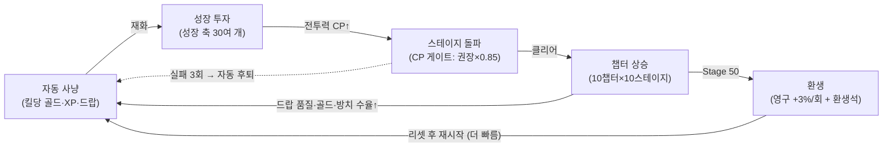
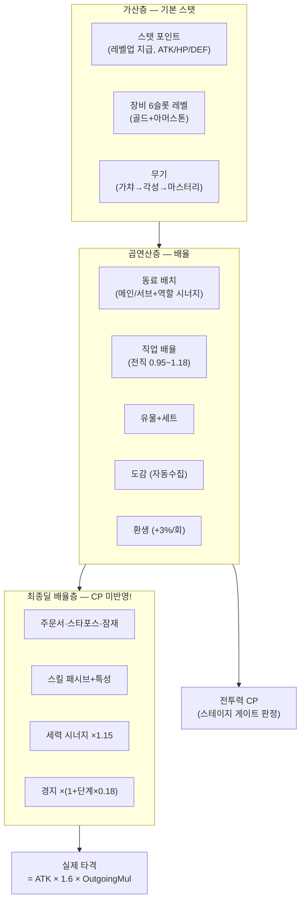
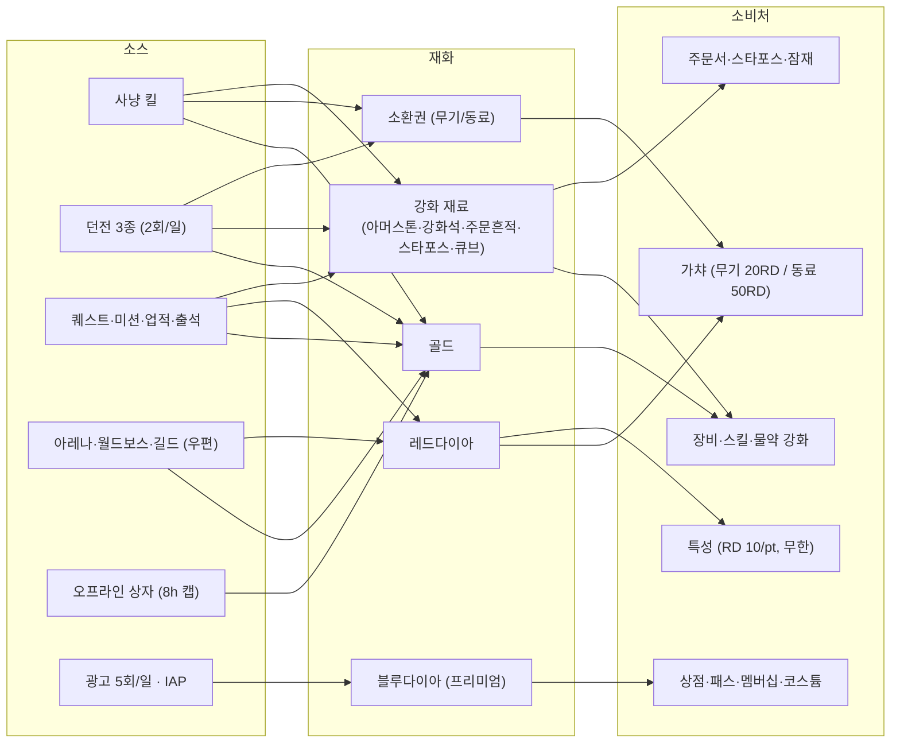
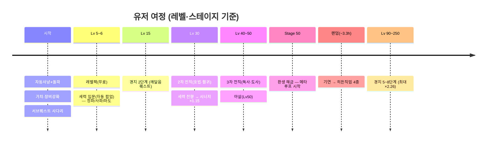

# 게임 흐름 전체 맵 — 성장·재화·콘텐츠·보상 (2026-08-16, 코드 전수 추출)

> 코드 근거로 추출한 실제 구현 상태다. 상상으로 쓴 기획서가 아니라 "지금 게임이 실제로
> 도는 방식"이며, 마지막 장의 진단(끊긴 회로·공백)이 이 문서의 존재 이유다.

## 1. 코어 루프

- 돌파 실패 3회 → 클리어 가능한 최고 사냥터로 자동 후퇴 (`FieldAutoHuntController`)
- 오버킬 방지: CP > 권장×1.15 사냥터는 보상 ×0.65 → 상위 사냥터로 유도
- 챕터 상승의 실이득: 강화석 `4+ch×2`, Epic 확률 `0.02+ch×0.008`, 방치 상자 수율(분당 골드 `10+stage×2.5`), 던전 보상 스케일 `1+stage×0.08`

## 2. 캐릭터가 강해지는 축 (전투력 합산 순서)

| 층 | 축 (소모 재화) |
|---|---|
| 가산 | 스탯포인트(무료), 장비 슬롯(골드+아머스톤), 무기 마스터리(무기강화석), 엘리트 소환(몬스터P) |
| 곱연산 | 동료(티켓/RD), 직업(레벨 조건), 유물(드랍), 도감(자동), 환생(스테이지 50) |
| 최종딜(OutgoingMul) | 주문서(주문흔적), 스타포스(주문서), 잠재(큐브), 스킬(골드+강화석+RD), 특성(RD), 세력 시너지(전향), 경지(깨달음 퀘스트) |
| 생존 | 물약 강화(골드, L30까지 회복 100%·쿨 15초), HP 스탯, 동료 HP% |

**전투력 공식** (`CombatPowerService`): `CP = Atk×10 + MaxHp×0.05 + Def×8 + Level×15 + SlotCp + CompanionCp + SkillCp + CostumeCp + ArtifactCp + 무기보유점수`

## 3. 재화 순환 (12종 + 별도 지갑 3종)

| 재화 | 주 획득 | 주 소비 | 상태 |
|---|---|---|---|
| 골드 | 킬·던전·오프라인·퀘스트 | 장비/스킬/물약 강화, 길드 기부 | 건강 |
| 레드다이아 | 퀘스트·미션·업적·아레나·보스 | 가챠 대체, 특성(무한 싱크), 상점 | 건강 |
| 블루다이아 | 광고 5회/일·IAP·출석 | 멤버십·코스튬·패스·월간 | 건강 (프리미엄) |
| 무기/동료 소환권 | 킬 8%/4%·던전·패스 | 가챠 | 건강 |
| 강화 재료 5종 | 던전(연무의탑)·드랍·분해 | 주문서/스타포스/잠재/레벨업 | 건강 |
| 몬스터 포인트 | 킬 0.4 고정 | 엘리트 소환 10 | 건강 |
| **애디셔널 큐브** | 킬 3% | **없음** | **데드 재화** |
| 환생석(별도) | 환생 시 MaxWave/10 | 환생 상점 3종 | 건강 |

## 4. 콘텐츠 해금 타임라인

일일 루프: 던전 3종×2회 → 아레나 5회 → 월드보스 1회 → 일일미션 5종(+올클리어 RD20) → 길드 기부 3회 → 광고 5회 → 오프라인 상자. 시즌패스 XP는 일일미션에 자동 연동.

## 5. 소프트월 설계 (막히는 곳과 뚫는 수단)

| 벽 | 판정 | 뚫는 수단 |
|---|---|---|
| CP 하드 게이트 | CP < 권장×0.85 → 돌파·이동 차단 | 성장 축 전부 (유료 우회 없음) |
| 보스 제한시간 | 60/75/90초 DPS 체크 | OutgoingMul 축 (주문서·경지·시너지) |
| HP 생존 | 물약 자동(40% 이하) | 물약 강화(골드), RD 물약팩 |
| 강화 확률벽 | 스타포스 13성↑ 하락, 15성↑ 5% 파괴 | RD5000+골드100만 복구 |
| 일일 캡 | 던전·아레나·보스·광고 | 없음 (광고 티켓 미구현) |
| 방치 캡 8h | 초과분 소멸 | 멤버십(12h)·빠른사냥 |
| 가챠 천장 | Epic 20연 / Legendary 80연 확정 | — |

## 6. 진단 — 부족한 곳 (2026-08-16 기준)

### A. 끊긴 회로 (만들다 만 것)
1. **애디셔널 큐브 데드 재화** — 킬 3%로 계속 쌓이는데 소비처가 없다. 잠재 리롤 상위 재화(에픽 잠재 전용 등)로 배선하거나 드랍을 끊어야 한다.
2. **장비 합성(룬 융합) 스텁** — `Open("rune")` 화면이 토스트만 띄운다. 구현하거나 진입을 숨겨야 한다.
3. **던전 광고 티켓 미구현** — balance-seed의 `adTickets: 1`을 코드가 안 읽는다. 일일 캡의 광고 우회가 벤치마크 표준인데 빠져 있다.
4. **도감 전용 UI 없음** — 보너스는 실제로 적용되지만 유저가 볼 화면이 없다. 보이지 않는 성장축은 없는 것과 같다.

### B. 성장축 공백 (벤치마크 대비)
5. **공격 속도가 고정 상수** — `GetAttackSpeedPct()` ≈ 222% 고정. 키우기류의 핵심 성장/과금 축인 공속 성장이 없다.
6. **CP에 OutgoingMul 미반영** — 경지·시너지·주문서/스타포스 배율이 전투력 숫자에 안 잡힌다. 실제 딜은 충분한데 CP 게이트에 막히는 역전이 발생 가능. CP 공식에 `×OutgoingMul` 반영 검토.
7. **길드·아레나가 보상 전달만** — 전투 스탯 기여가 0. 벤치마크는 길드 버프/아레나 랭크 보너스가 있다.

### C. 수치 불일치 (한 곳의 정의가 사문화)
8. `offlineCapHours: 10`(balance-seed) vs 하드코딩 8/12h — seed가 사문화.
9. `fastRewardPerDay: 3`(seed) vs `DailyLimit=2`(ShopCatalog).
10. 멤버십 카탈로그 표시가 블루 100 vs 실가 80.
11. `CombatPowerService.cs:95` 무의미한 식(`a + (b-a)` = b) — 표시용이지만 정리 대상.

### 우선순위 제안
| 순위 | 항목 | 근거 |
|---|---|---|
| 1 | 공속 성장 축 신설 | 벤치마크 핵심 축 공백 — 성장 체감·과금 설계 양쪽에 구멍 |
| 2 | CP에 OutgoingMul 반영 | 게이트 오판 = 유저가 이유 모르고 막힘 |
| 3 | 도감 UI | 이미 작동하는 시스템의 가시화 — 비용 대비 효과 최대 |
| 4 | 애디셔널 큐브 소비처 | 데드 재화는 버그로 보인다 |
| 5 | 룬 융합 구현 or 숨김 | 눌러도 안 되는 버튼은 신뢰를 깎는다 |
| 6 | 수치 불일치 4건 | 한 시간 미만 청소 |
